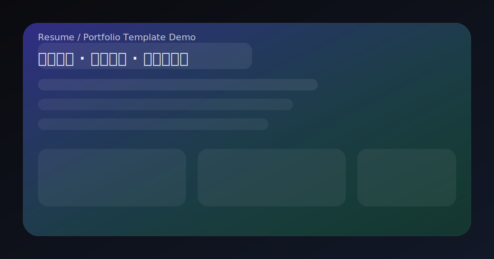

## 可部署的静态作品集模板（Next.js）

配置 `src/content/*.json`，输出可部署的静态站点（支持首页、作品集列表/详情、学习列表、经历详情、sitemap）。



## 1 分钟跑起来

```bash
npm install
npm run dev
```

打开 `http://localhost:3000` 预览。

## 内容编辑（只改这 3 个文件）

- 站点信息：`src/content/site.json`
- 作品列表：`src/content/projects.json`
- 学习记录：`src/content/learning.json`

建议在 `site.json` 补齐部署域名（用于 sitemap/SEO）：

```json
{
  "siteUrl": "https://your-domain.com"
}
```

### 简历下载（PDF）

把你的 PDF 放到 `public/resume.pdf`，并在 `site.json` 配置入口：

```json
{
  "resume": { "label": "下载简历", "href": "/resume.pdf", "download": true }
}
```

## 构建（静态导出）

```bash
npm run build
```

构建产物在 `out/`，可直接部署到任意静态托管平台。

## 一键部署（GitHub Pages，推荐）

本仓库自带 GitHub Pages 工作流：push 后自动构建 `out/` 并发布。

1. Fork 该仓库到你的 GitHub
2. 在仓库 Settings → Pages 中，Source 选择 GitHub Actions
3. 修改 `src/content/site.json` 的 `siteUrl`，设置为：
   - `https://<你的用户名>.github.io/<仓库名>`
4. 推送到 `main`，等待 Actions 完成部署

## 常见问题

- 静态导出开启了 `trailingSlash`：站内链接统一使用 `/projects/` 这种带尾斜杠的路径，静态托管更稳定。
- 内容文件字段不对会在构建阶段报错：错误信息包含字段路径与修复提示（便于快速定位）。
